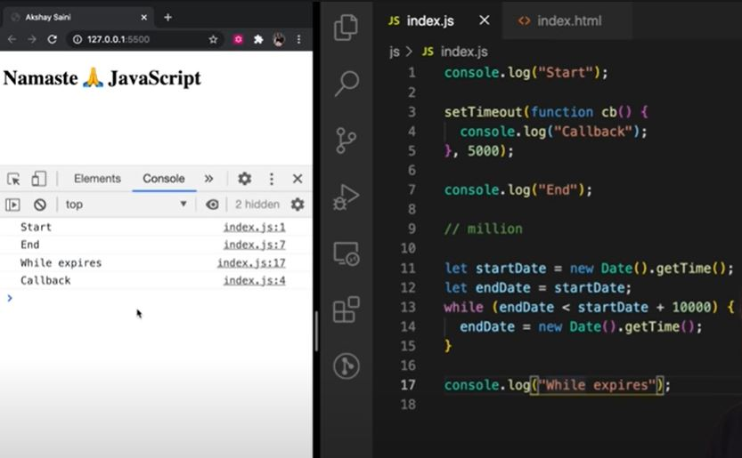

# Episode 17 : Trust issues with setTimeout()

* setTimeout with timer of 5 secs sometimes does not exactly guarantees that the callback function will execute exactly after 5s.

* Let's observe the below code and it's explaination
    ```js
    console.log("Start");
    setTimeout(function cb() {
    console.log("Callback");
    }, 5000);
    console.log("End");
    // Millions of lines of code to execute

    // o/p: Over here setTimeout exactly doesn't guarantee that the callback function will be called exactly after 5s. Maybe 6,7 or even 10! It all depends on callstack. Why?
    ```
    Reason?
    
    * First GEC is created and pushed in callstack.
    * Start is printed in console
    * When setTimeout is seen, callback function is registered into webapi's env. And timer is attached to it and started. callback waits for its turn to be execeuted once timer expires. But JS waits for none. Goes to next line.
    * End is printed in console.
    * After "End", we have 1 million lines of code that takes 10 sec(say) to finish execution. So GEC won't pop out of stack. It runs all the code for 10 sec.
    * But in the background, the timer runs for 5s. While callstack runs the 1M line of code, this timer has already expired and callback fun has been pushed to Callback queue and waiting to pushed to callstack to get executed.
    * Event loop keeps checking if callstack is empty or not. But here GEC is still in stack so cb can't be popped from callback Queue and pushed to CallStack. **Though setTimeout is only for 5s, it waits for 10s until callstack is empty before it can execute** (When GEC popped after 10sec, callstack() is pushed into call stack and immediately executed (Whatever is pushed to callstack is executed instantly).
    * This is called as the **[Concurrency model](https://developer.mozilla.org/en-US/docs/Web/JavaScript/EventLoop)** of JS. This is the logic behind setTimeout's trust issues.

* The First rule of JavaScript: Do not **block the main thread** (as JS is a single threaded(only 1 callstack) language).

* In below example, we are blocking the main thread. Observe Questiona and Output.


* setTimeout guarantees that it will take at least the given timer to execute the code.

* JS is a synchronous single threaded language. With just 1 thread it runs all pieces of code. It becomes kind of an interpreter language, and runs code very fast inside browser (no need to wait for code to be compiled) (JIT - Just in time compilation). And there are still ways to do async operations as well.

* What if **timeout = 0sec**?
    ```js
    console.log("Start");
    setTimeout(function cb() {
    console.log("Callback");
    }, 0);
    console.log("End");
    // Even though timer = 0s, the cb() has to go through the queue. Registers calback in webapi's env , moves to callback queue, and execute once callstack is empty.
    // O/p - Start End Callback
    // This method of putting timer = 0, can be used to defer a less imp function by a little so the more important function(here printing "End") can take place
    ```

<hr>
